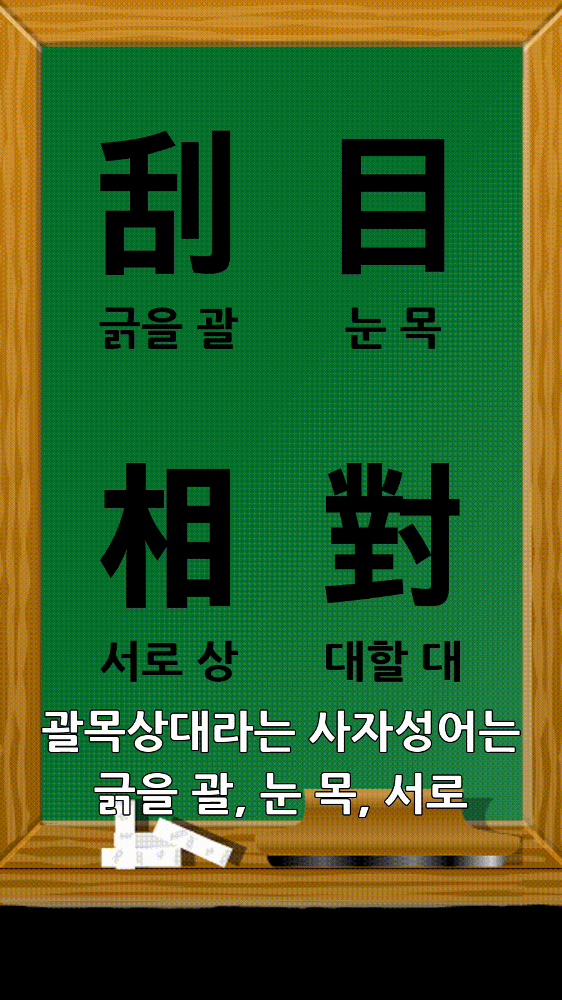
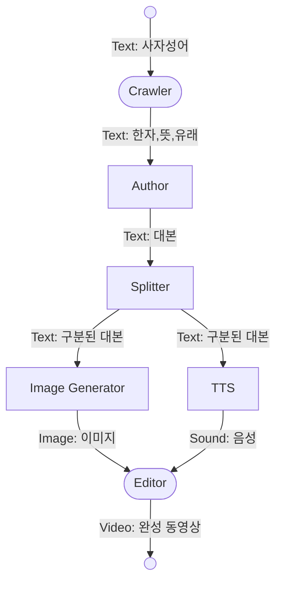
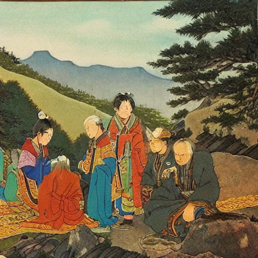
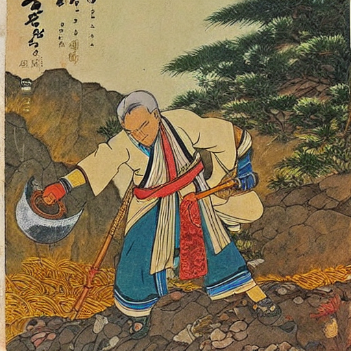
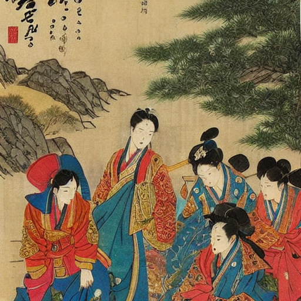
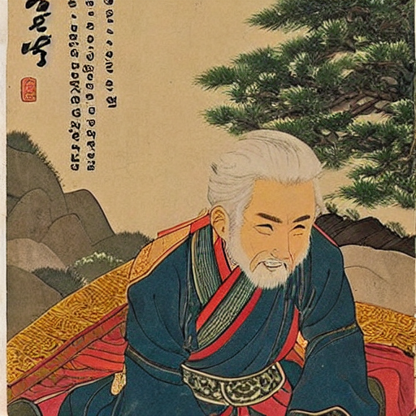

# HanjaShortsGenerator

## Examples
Examples of shorts videos made from automated pipeline. 
There might some weird points in these videos, because they're generated automatically. 
You can edit what you want and regenerate the video, as explained [here](#regenerate-video). 
|괄목상대|어부지리|
|-|-|
|[](assets/괄목상대.mp4)|[](assets/어부지리.mp4)|

## Environment
- windows 10
- python 3.11.4
- selenium 4.11.2
- openai 0.27.9
- google-api-core 2.11.1
- google-cloud-texttospeech 2.14.1
- pillow 9.3.0
- diffusers 0.20.2
- moviepy 1.0.3

## How to use
0. make your own GCP project and get json key file. 
0. set environment variables for GCP: `set GOOGLE_APPLICATION_CREDENTIALS=[GCP_KEY_LOCATION].json`
0. get your own API keys for:
	- openai API
	- pixabay API
	- pexels API
0. make `keys.py` with your API keys and save it in project root:
	```python
	openai_api_key = "XXX"
	pixabay_api_key = "XXX"
	pexels_api_key = "XXX"
	```
0. download your own Korean font as `.ttf` file.
0. install requirements: `pip install -r requirements.txt`
0. run `main.py`
	- usage
		```commandline
		usage: main.py [-h] [--start-from {keyword,data,scripts,scenes,audios,story,clips}] [--gpt-model {gpt-3.5-turbo}] [--gpt-temp GPT_TEMP] [--sd-model {stabilityai/stable-diffusion-xl-base-1.0}] [--sd-seed SD_SEED] [--width WIDTH] [--height HEIGHT] [--chalkboard CHALKBOARD] [--font FONT] [--text-chinese-size TEXT_CHINESE_SIZE] [--text-korean-size TEXT_KOREAN_SIZE] [--text-chinese-color TEXT_CHINESE_COLOR] [--fps FPS] [--text-size TEXT_SIZE] [--text-color TEXT_COLOR] [--text-stroke-width TEXT_STROKE_WIDTH] [--text-stroke-color TEXT_STROKE_COLOR] [--bgm BGM] [--bgm-vol BGM_VOL]  
		keyword

		positional arguments:
			keyword               사자성어 혹은 고사성어

		options:
			-h, --help            show this help message and exit
			--start-from {keyword,data,scripts,scenes,audios,story,clips}
														영상 제작 시작 지점. (keyword: 처음부터, data: 크롤링 데이터부터, scripts: 작성된 대본부터, scenes: 장면별로 구분된 대본부터, audios: 대본, 오디오부터, story: 대본, 오디오, 이미지 설명부터, clips: 대본, 오디오, 비디오부터)
			--gpt-model {gpt-3.5-turbo}
														ChatGPT 모델
			--gpt-temp GPT_TEMP   ChatGPT 모델 창의성 (0.0 ~ 1.0)
			--sd-model {stabilityai/stable-diffusion-xl-base-1.0}
														Stable Diffusion 모델
			--sd-seed SD_SEED     Stable Diffusion seed값 (-1일 경우 random seed)
			--width WIDTH         영상의 가로 길이
			--height HEIGHT       영상의 세로 길이
			--chalkboard CHALKBOARD
														사자성어 소개 장면 배경. default 값 그대로 쓰는 것을 추천.
			--font FONT           자막 폰트 파일 위치
			--text-chinese-size TEXT_CHINESE_SIZE
														사자성어 소개 장면 한자 크기
			--text-korean-size TEXT_KOREAN_SIZE
														사자성어 소개 장면 훈음 크기
			--text-chinese-color TEXT_CHINESE_COLOR
														사자성어 소개 장면 한자 색
			--fps FPS             영상의 FPS
			--text-size TEXT_SIZE
														자막 크기
			--text-color TEXT_COLOR
														자막 색깔
			--text-stroke-width TEXT_STROKE_WIDTH
														자막 가장자리 두께
			--text-stroke-color TEXT_STROKE_COLOR
														자막 가장자리 색깔
			--bgm BGM             영상 배경음악
			--bgm-vol BGM_VOL     영상 배경음악 볼륨 조절 (0.0 ~ 1.0)
		```
	- example
		```commandline
		# Windows
		python main.py 사면초가 ^
			--width 900 ^
			--height 1600 ^
			--text-chinese-size 254 ^
			--text-korean-size 72 ^
			--fps 30 ^
			--text-size 72 ^
			--start-from audios

		# OSX
		python main.py 우공이산 \
			--width 900 \
			--height 1600 \
			--text-chinese-size 254 \
			--text-korean-size 72 \
			--fps 30 \
			--text-size 72
		```

## Regenerate Video
이미 생성된 쇼츠 비디오의 내용이 마음에 들지 않아 바꾸고 싶다면, 비디오 생성 과정에서 생성된 `temp.json` 파일을 수정하여 다시 비디오를 생성할 수 있다. `temp.json`의 내용은 아래와 같다. 

```json
{
  "data": {
    "keyword": "어부지리",
    "chinese": "漁夫之利",
    "hanja": "漁 고기 잡을 어 夫 지아비 부 之 갈 지 利 이로울 리(이)",
    "mean": "1. 「어부(漁夫)의 이익(利益)」이라는 뜻으로, 「둘이 다투는 틈을 타서 엉뚱한 제3자(第三者)가 이익(利益)을 가로챔.」을 이르는 말.",
    "story": "전국시대(戰國時代) 진나라(秦--)는 여러 나라를 병탄(竝呑ㆍ倂呑)하여 천하(天下)를 제압(制壓)하려고 했다. 이때 조나라(趙--)와 연나라(燕--) 사이에 마찰(摩擦)이 생겨, 조나라(趙--)는 연나라(燕--)를 침략(侵略)하고자 준비(準備)를 서둘렀다. 그래서 연나라(燕--) 소왕(昭王)은 소대(蘇代)를 조나라(趙--)에 보내어 혜왕(惠王)을 설득(說得)하도록 했다. 조나라(趙--)에 도착(到着)한 소대(蘇代)는 한 가지 예를 들어 혜왕(惠王)을 설득(說得)했다. 「제가 이 나라에 들어올 때, 역수(易水)를 지나다가 우연(偶然)히 냇가를 보니 조개가 입을 벌리고 볕을 쬐고 있었는데, 황새 한 마리가 날아와 조개를 쪼자, 조개는 급히 입을 꽉다물어 버렸습니다. 다급(多急)해진 황새가 「오늘도 내일(來日)도 비가 오지 않으면 목이 말라죽을 것이다.」라고 하자, 조개도 「내가 오늘도 내일(來日)도 놓지 않고 꽉 물고 있으면 너야말로 굶어 죽고 말걸.」 했습니다. 이렇게 한참 다투고 있는데, 지나가던 어부(漁夫ㆍ漁父)가 이를 보고, 힘들이지 않고 둘 다 잡아가고 말았습니다. 왕(王)은 지금 연나라(燕--)를 치려 하십니다만, 연나라(燕--)가 조개라면 조나라(趙--)는 황새입니다. 지금 연나라(燕--)와 조나라(趙--)가 공연(空然)히 싸워 국력(國力)을 소모(消耗)하면, 저 강대(強大)한 진나라(秦--)가 어부(漁夫ㆍ漁父)가 되어 맛있는 국물을 마시게 될 것입니다.」 하고 말했다. 조나라(趙--) 혜문왕(惠王)도 현명(賢明)한 까닭에 소대(蘇代)의 말을 알아듣고 연나라(燕--)를 치려던 계획(計劃ㆍ計畫)을 중단(中斷)했다고 한다."
  },
  "scripts": "장면 1\n호스트: 여러분은 두 사람이 다투는 틈을 타서 엉뚱한 제3자가 이익을 취하는 상황을 겪어 본 적이 있으신가요? 오늘은 그런 상황을 나타내는 사자성어, 어부지리에 대해 이야기해 볼까요?\n장면 2\n호스트: 어부지리. 고기를 잡는 어부의 이익을 뜻하는 사자성어에요. 두 사람이 다투는 틈을 타서 엉뚱한 제3자가 이익을 취한다는 의미를 가지고 있어요.\n장면 3\n호스트: 어부지리의 유래는 전국시대 진나라가 여러 나라를 병탄하여 천하를 제압하려고 했던 때의 이야기에요.\n호스트: 조나라와 연나라 사이에 마찰이 생겨 조나라는 연나라를 침략하려고 준비를 하게 되었어요.\n호스트: 그때 연나라 소왕은 조나라에 소대를 보내 혜왕을 설득하도록 했어요.\n소대: 한 가지 예를 들어 혜왕을 설득해 볼게요. 어부가 볕을 쬐는 조개를 보고 황새가 조개를 쪼아먹으려고 하지만 조개는 꽉 다물어버립니다. 황새는 물이 오지 않으면 목이 말라 죽을 것이라고 말합니다. 그러자 조개는 내가 오늘도 내일도 꽉 다물고 있으면 너야말로 굶어 죽을 것이라고 대답합니다.\n소대: 이렇게 다투고 있는데 어부가 와서 둘 다 잡아가버립니다. 현재 조나라와 연나라가 싸워 국력을 소모한다면 진나라가 어부가 되어 맛있는 국물을 마시게 될 거라고 말해요.\n소대: 혜왕도 현명한 판단으로 연나라를 치려던 계획을 중단하게 되었습니다.\n장면 4\n호스트: 어부지리는 두 사람이 다투는 틈을 타서 엉뚱한 제3자가 이익을 취한다는 교훈을 전달합니다. 때로는 다투지 않고 협력하여 공동의 이익을 추구하는 것이 중요하다는 것을 알려줍니다.\n호스트: 그래서 우리는 자신의 이익만을 추구하는 것이 아니라 타인과의 협력과 팀워크를 통해 더 큰 이익을 얻을 수 있는 방법을",
  "speakers": [
    "호스트",
    "소대"
  ],
  "scenes": [
    [
      {
        "speaker": 0,
        "content": "여러분은 두 사람이 다투는 틈을 타서 엉뚱한 제3자가 이익을 취하는 상황을 겪어 본 적이 있으신가요? 오늘은 그런 상황을 나타내는 사자성어, 어부지리에 대해 이야기해 볼까요?",
        "audio_name": "video_outputs\\어부지리\\audio-0-0.mp3",
        "duration": 10.464,
        "image_name": "video_outputs\\어부지리\\image-intro-0.mp4"
      }
    ],
    [
      {
        "speaker": 0,
        "content": "어부지리. 어부의 이익을 뜻하는 사자성어에요. 두 사람이 다투는 틈을 타서 엉뚱한 제3자가 이익을 취한다는 의미를 가지고 있어요.",
        "audio_name": "video_outputs\\어부지리\\audio-1-0.mp3",
        "duration": 8.184,
        "image_name": "video_outputs\\어부지리\\image-hanja.png"
      }
    ],
    [
      {
        "speaker": 0,
        "content": "어부지리의 유래는 전국시대 진나라가 여러 나라를 병탄하여 천하를 제압하려고 했던 때의 이야기에요.",
        "audio_name": "video_outputs\\어부지리\\audio-2-0.mp3",
        "duration": 6.192,
        "image_name": "video_outputs\\어부지리\\image-story-0.png"
      },
      {
        "speaker": 0,
        "content": "조나라와 연나라 사이에 마찰이 생겨 조나라는 연나라를 침략하려고 준비를 하게 되었어요. 연나라의 사신 소대는 조나라의 혜왕을 설득하기 위해 이야기 하나를 하게 돼요.",
        "audio_name": "video_outputs\\어부지리\\audio-2-1.mp3",
        "duration": 5.232,
        "image_name": "video_outputs\\어부지리\\image-story-1.png"
      },
      {
        "speaker": 1,
        "content": "우연히 냇가를 봤는데, 황새가 조개를 쪼아먹으려고 하지만 조개는 입을 다물어버렸습니다. 황새는 조개에게 물이 오지 않으면 목이 말라 죽을 것이라고 말했습니다. 그러자 조개는 내가 꽉 다물고 있으면 너야말로 굶어 죽을 것이라고 대답했습니다.",
        "audio_name": "video_outputs\\어부지리\\audio-2-3.mp3",
        "duration": 12.312,
        "image_name": "video_outputs\\어부지리\\image-story-2.png"
      },
      {
        "speaker": 1,
        "content": "이렇게 다투고 있는데 어부가 와서 둘 다 잡아가버립니다. 현재 조나라와 연나라가 싸워 국력을 소모한다면 진나라가 어부가 되어 맛있는 국물을 마시게 될 것입니다.",
        "audio_name": "video_outputs\\어부지리\\audio-2-4.mp3",
        "duration": 8.592,
        "image_name": "video_outputs\\어부지리\\image-story-3.png"
      },
      {
        "speaker": 0,
        "content": "이에 설득된 혜왕은 연나라를 치려던 계획을 중단하게 되었습니다.",
        "audio_name": "video_outputs\\어부지리\\audio-2-5.mp3",
        "duration": 3.888,
        "image_name": "video_outputs\\어부지리\\image-story-4.png"
      }
    ],
    [
      {
        "speaker": 0,
        "content": "어부지리는 두 사람이 다투는 틈을 타서 엉뚱한 제3자가 이익을 취한다는 교훈을 전달합니다.",
        "audio_name": "video_outputs\\어부지리\\audio-3-0.mp3",
        "duration": 5.64,
        "image_name": "video_outputs\\어부지리\\image-outro-0.mp4"
      },
      {
        "speaker": 0,
        "content": "그래서 우리는 자신의 이익만을 추구하는 것이 아니라 타인과의 협력과 팀워크를 통해 더 큰 이익을 얻을 수 있는 방법을 생각해 봐야 해요.",
        "audio_name": "video_outputs\\어부지리\\audio-3-1.mp3",
        "duration": 7.776,
        "image_name": "video_outputs\\어부지리\\image-outro-1.jpeg"
      }
    ]
  ],
  "story": {
    "summary": "A messenger persuades King Hye to stop invading Yeon nation with a story about a clam and a stork",
    "instructions": [
      "scene of conflict between two kingdoms, with soldiers preparing for battle",
      "a diploma, middle-aged man standing toward King Hye, an old man sitting on his chair in his palace",
      "scene of a stork and a clam bitting each other's mouth, at a river",
      "scene of a fisherman, middle-aged man carrying a stork and a clam, at a river",
      "King Hye, an old man sitting on his chair in his palace"
    ]
  }
}
```

파일의 내용을 원하는 대로 수정한 다음, 다시 스크립트를 실행한다. 이때 `--start-from` 옵션을 선택해 주어야 한다. 
아래의 예시는 대본의 내용이 틀렸거나 수정하고 싶을 때 음성 생성, 이미지 생성, 영상 편집을 다시 수행하는 코드이다.

```commandline
python main.py 우공이산 --start-from scenes
```

## Pipeline


## Crawler
네이버 한자사전에서 주어진 사자성어 (혹은 고사성어) 를 검색하여 한자, 의미, 그리고 유래를 얻는다. 

## Author
사자성어 (혹은 고사성어) 정보를 이용하여 유튜브 쇼츠 대본을 작성한다. 대본의 구성은 아래와 같이 작성한다. 

0. 호스트가 시청자들에게 사자성어에 관련된 흥미로운 질문을 던지며 동영상이 시작된다. 
0. 호스트가 사자성어의 한자를 한 글자씩 간략하게 설명하고 사자성어의 뜻을 설명해 준다. 
0. 호스트가 사자성어의 유래를 이야기 형식으로 설명하며, 중간중간 등장 인물의 대사를 섞어 준다. 
0. 호스트가 사자성어의 뜻과 유래를 통해 얻을 수 있는 교훈을 시청자들에게 설명하며 동영상이 끝난다. 

대본 작성을 위한 기술로는 [ChatGPT](https://chat.openai.com/)와 [KoAlpaca](https://github.com/Beomi/KoAlpaca)를 고려하였다. 선택을 위해 내가 고려한 사항은 아래와 같다. 

||ChatGPT|KoAlpaca|
|-|-|-|
|성능|상대적으로 좋음|상대적으로 나쁨|
|모델 크기|상대적으로 큼|상대적으로 작음|
|Few-shot|가능|가능|
|로컬 실행|불가능|가능|
|API 지원|지원|미지원|
|가격|유료|로컬 실행 시 무료|

ChatGPT를 사용한다면 파이썬 환경에서 API 호출을 통해 사용하고, KoAlpaca를 사용한다면 로컬 컴퓨터에 모델을 다운로드하여 사용하고자 하였다. 그러나 KoAlpaca를 로컬에서 실행할 정도로 로컬 컴퓨터 성능이 좋지 않고 ChatGPT의 API가 접근성이 훨씬 좋았기 때문에 일단 ChatGPT API를 활용하기로 하였다. 추후 KoAlpaca를 로컬 환경에서 실행하는 것이 가능해지면 KoAlpaca와 비교해 볼 예정이다. 

ChatGPT와 KoAlpaca 모두 내가 제시한 대본 형식을 따르지 않거나 사실과 다른 내용을 제공할 때가 있다. 따라서 여러 번 결과를 내도록 하거나 검수하는 과정이 필수적이다. 

## Splitter
[Author](#author)에서 작성된 대본을 [TTS](#tts)나 [Image Generator](#image-generator)에서 쉽게 이해할 수 있도록 형식을 변환하고, 이미지 기준으로 분리하는 역할을 한다. (한 이미지/동영상을 띄워 놓고 어디까지 말할 것인가? 를 정한다.)

`Splitter` 클래스의 `split()` 함수는 두 개의 값을 반환한다 - `speakers`, `scenes` - 그리고 두 값의 형태는 아래와 같다. 

### speakers
```json
["호스트", "우공"]
```

### scenes
```json
[
	[
		{"speaker": 0, "content": "어떻게 보면 어리석은 일처럼 보이지만 한 가지 일을 끝까지 밀고 나가면 언젠가는 목적을 달성할 수 있다고 생각해 본 적이 있으신가요? 오늘은 그런 상황을 나타내는 사자성어, '우공이산'에 대해 이야기해 볼까요?"}
	], 
	[
		{"speaker": 0, "content": "우공이산. 어리석을 우, 공평할 공, 옮길 이, 산 메 산으로 이루어진 사자성어에요. 남이 보기에는 어리석은 일처럼 보이지만 한 가지 일을 끝까지 밀고 나가면 언젠가는 목적을 달성할 수 있다는 의미를 가지고 있어요."}
	], 
	[
		{"speaker": 0, "content": "우공이산의 유래는 중국 북산에 우공이라는 90세 된 노인이 살고 있었어요. 그는 태행산과 왕옥산 사이에 있는 큰 산을 평평하게 만들어서 길을 내고 싶다고 가족들에게 말했어요. 아내는 반대하며 그의 힘으로는 불가능하다고 말했지만 우공은 결심하고 돌과 흙을 파내어 나르기 시작했어요."},
		{"speaker": 1, "content": "이렇게 해서 언젠가는 산을 옮길 수 있을 거야!"},
		{"speaker": 0, "content": "사람들은 우공을 비웃었지만 그는 자신의 결심에 힘입어 끝까지 일을 밀고 나갔어요. 결국 천제의 감동을 받아 산은 다른 곳으로 옮겨지게 되었답니다."}
	],
	[
		{"speaker": 0, "content": "'우공이산'은 우리에게 한 가지 일에 집중하고 끝까지 밀고 나가는 열정과 결단력의 중요성을 상기시켜줍니다. 어리석어 보일지라도 끝까지 노력하면 언젠가는 목적을 달성할 수 있다는 교훈이 담겨있어요."},
		{"speaker": 0, "content": "그래서 우리는 어떤 어려움이 있더라도 포기하지 않고 열심히 노력하며 끝까지 밀고 나가는 자세를 가지는 것이 중요하다는 것을 기억해야 합니다."}
	]
]
```

## TTS
 부분에서 작성한 대본을 Text-to-Speech 기술을 활용하여 음성으로 변환한다. 
TTS 기술로는 를 이용하였다. 월 100만 토큰까지 무료로 제공하는 WaveNet을 사용하였다. WaveNet은 한국어로 2개의 여성 목소리와 2개의 남성 목소리를 제공한다. 이 프로젝트의 특성 상 더 많은 인물이 필요하지 않다고 생각하여 WaveNet을 우선 사용한다. 

`TTS` 클래스는 `Splitter`의 반환값을 이용하여 음성을 제작한다. 등장 인물이 여러 명일 경우를 대비해 여러 개의 `Speaker` 인스턴스를 가지고 대본을 읽는다. 반환 형식은 위의 [scenes](#scenes)와 같으나, 각 대사마다 `audio_name`과 `duration` 필드가 추가되어 있다. 

해결해야 할 문제로는 음성의 성별을 선택하는 데 애로사항이 있다는 것이다. 호스트의 목소리는 여성으로 고정하였으나, 유래를 설명할 때 등장하는 인물의 성별을 판별하는 기능을 구축하지 못하였다. 고사성어의 대부분의 유래는 과거 시대 중국이 배경이므로 등장 인물의 목소리는 남자의 목소리로 가정하였으나, 휴리스틱한 방법이므로 수정이 꼭 필요하다. 

## Image Generator
장면 1: Pixabay, Pexels에서 적절한 무료 사진/동영상을 가져온다.
장면 2: 고정된 배경에 한자와 훈음, 사자성어의 뜻을 표기한다. 
장면 3: Stable Diffusion을 통해 이야기에 맞는 이미지를 생성한다. 
장면 4: Pixabay, Pexels에서 적절한 무료 사진/동영상을 가져온다. 

이 단계에서는 세 가지 방법으로 이미지 혹은 비디오를 얻는다. 
따라서 나는 세 가지 방법에 대해 각각 하나씩 클래스를 만들었고, 그 세 방법을 이용해 쇼츠 동영상을 위한 이미지 혹은 비디오 자료를 만들거나 얻는 `Imager` 클래스를 만들었다. 

- `ImageConstructor`: 지정된 배경 사진에 사자성어의 한자와 훈음을 추가한 사진을 생성한다. 
- `ImageGenerator`: 사자성어의 유래 이야기에 대해서 각 장면을 Stable Diffusion 모델을 이용하여 생성한다. 
- `ImageParser`: Pixabay와 Pexels에서 적절한 무료 사진/동영상을 가져온다.

### Image Constructor (장면 2)
주어진 사진에 사자성어의 한자와 훈음을 표기하여 그 이미지를 저장하는 과정이다. (나는 칠판 사진을 배경으로 사용하였다.)

이미지에 한자와 훈음을 추가하는 데에는 PILLOW를 사용하였다. 

### Image Generator (장면 3)
사자성어 유래 이야기에 대해 전체 이야기의 줄거리와 각 장면에 대한 설명을 생성하도록 Chat-GPT에게 물어본다. 
그 결과, 아래와 같은 형태의 설명을 얻을 수 있다.

```json
{
	"summary": "determined old man successfully moving a mountain with his determination and hard work", 
	"instructions": [
		"a scenic view of a mountain range with an old man, around 90 years old, living in a small house", 
		"an old man discussing with his family about his plan to flatten a mountain and create a road", 
		"the old man starting to dig and move rocks and dirt with determination", 
		"people laughing and mocking the old man's impossible task", 
		"the old man persistently working on moving the mountain despite the ridicule", 
		"a miraculous scene of the mountain being moved to another location by divine intervention"
	]
}
```

Stable Diffusion 모델에 전체적인 줄거리와 현재 장면에 대한 설명, 그리고 생성될 이미지의 특징 등을 입력하여 이미지를 생성한다. 
Stable Diffusion 모델에 입력되는 프롬프트의 예시와 출력된 이미지 예시는 아래와 같다. 
줄거리와 현재 상황에 대한 설명 외의 특징을 나타내는 프롬프트와 negative 프롬프트는 [prompts.py](image/prompts.py)에서 확인할 수 있다.

|Summary|Instruction|Output|
|-|-|-|
|determined old man successfully moving a mountain with his determination and hard work|a scenic view of a mountain range with an old man, around 90 years old, living in a small house||
|determined old man successfully moving a mountain with his determination and hard work|an old man discussing with his family about his plan to flatten a mountain and create a road||
|determined old man successfully moving a mountain with his determination and hard work|the old man starting to dig and move rocks and dirt with determination||
|determined old man successfully moving a mountain with his determination and hard work|people laughing and mocking the old man's impossible task||
|determined old man successfully moving a mountain with his determination and hard work|the old man persistently working on moving the mountain despite the ridicule||
|determined old man successfully moving a mountain with his determination and hard work|a miraculous scene of the mountain being moved to another location by divine intervention||

### Image Parser (장면 1, 장면 4)
Pexels와 Pixabay에서 영상 인트로와 아웃트로에 알맞은 이미지나 영상을 가져오는 역할을 한다. 

각각의 스톡 사이트에서 여러 개의 이미지 및 영상을 가져 와 그 중 하나를 임의로 선택한다. 

검색어는 Chat-GPT에 현재 대사에 대해 두 개의 단어를 추천해 달라고 하여 얻을 수 있었다. 

|Line|Keyword|Parsed Image|
|-|-|-|
|어떻게 보면 어리석은 일처럼 보이지만 한 가지 일을 끝까지 밀고 나가면 언젠가는 목적을 달성할 수 있다고 생각해 본 적이 있으신가요? 오늘은 그런 상황을 나타내는 사자성어, "우공이산"에 대해 이야기해 볼까요?|stupid, perserverance||
|"우공이산"은 우리에게 한 가지 일에 집중하고 끝까지 밀고 나가는 열정과 결단력의 중요성을 상기시켜줍니다. 어리석어 보일지라도 끝까지 노력하면 언젠가는 목적을 달성할 수 있다는 교훈이 담겨있어요.|concentration, perserverance||
|그래서 우리는 어떤 어려움이 있더라도 포기하지 않고 열심히 노력하며 끝까지 밀고 나가는 자세를 가지는 것이 중요하다는 것을 기억해야 합니다.|perserverance, determination||

## Editor
각 장면에 대한 음성과 자료 화면 (이미지 혹은 비디오) 이 모두 주어질 때 동영상을 편집하고 자막을 넣는 부분이다. 
moviepy를 활용하여 음성과 자료 화면을 합칠 수 있었고, 비디오 조각을 모아 하나의 동영상으로 만들 수 있었다. 

다만, moviepy의 `TextClip`을 활용하여 자막을 넣는 것은 실패하였다. `TextClip` 관련 기능은 ImageMagick을 설치해야 사용할 수 있는데, 이를 설치함에도 불구하고 자막이 만들어지지 않는 오류가 반복되어 보류하였다. 대안으로는 OpenCV를 활용하여 자막만 추가하는 방안을 생각 중이다. 

(Cont.) OpenCV를 이용하여 동영상에 텍스트를 삽입하려는 시도를 해 보았으나, 한글은 "???"로 나오는 오류가 발생하였다. 최종적으로는 pillow를 활용하여 각 프레임마다 알맞은 텍스트를 삽입하는 것으로 해결하였다. 

대사의 길이가 웬만한 상황에서는 휴대폰의 가로 길이보다 훨씬 길기 때문에, 적절히 잘라 잘 표기하는 것이 중요하다. 따라서 휴대폰의 가로 길이보다 짧은 길이의 문장 조각으로 대사를 나누었다. 한 번에 두 개의 문장 조각이 표시되도록 설정하였다. (두 줄씩 출력) 

하나의 대사를 두 개의 문장 조각씩 표시하므로 자막이 넘어가는 시간이 굉장히 중요하다. 문장 조각의 길이를 전체 시간을 나누는 가중치로 고려하여 동영상을 분할하는 방식을 사용하였다. 다만 단순히 문장 조각의 길이를 사용하는 것이 아니라 ".", "!", "?"로 끝나는 문장 조각에는 4글자가 더 있는 것으로 가정하였다. (Heuristic 방법) 실험 결과, 대략적으로 타이밍이 잘 맞는 것으로 보인다. 

문장 조각마다 정확한 시간을 부여하는 방식으로 간단한 파이썬 TTS 모듈인 pyttsx3를 활용하는 방법도 있다. pyttsx3를 이용하여 각 문장 조각을 읽어 보고, 그 시간을 가중치로 이용하여 전체 동영상 시간을 나누는 방법을 생각 중이다. 
